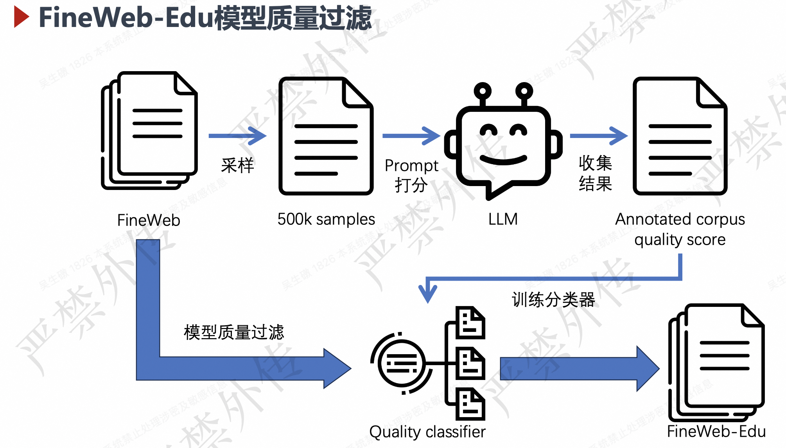
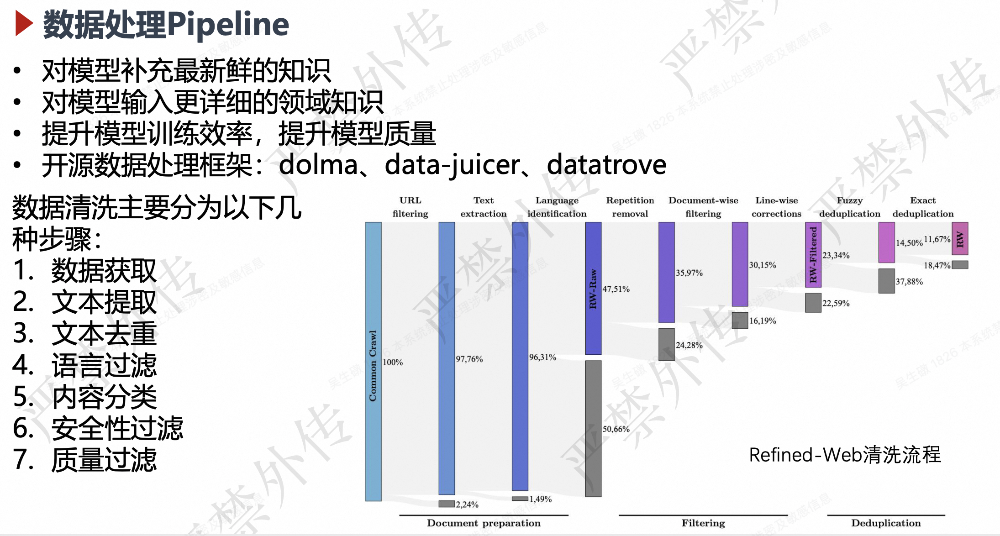

# 训练pipline
### **1\. 数据准备（Data Pipeline）​**​
​**​核心目标​**​：构建高质量、多样化的训练数据集。
​**​数据来源​**​：
* 公开数据集（如Common Crawl、Wikipedia、GitHub代码等）
* 领域特定数据（医疗、法律、金融等）
* 合成数据（通过规则或小模型生成）
* fineweb
   * 从CommonCrawl（自2013至2024年）中清洗、去重获得的15T tokens网页预训练语料。
   * url filtering$\to$text extracting$\to$language filtering$\to$Gopher filtering$\to$minhash dedup$\to$C4 filtering$\to$custom filtering
* fineweb-edu
   * 在FineWeb的基础上，采用通过大语言模型进行质量 分类的方法筛选出来的包含1.3T tokens的高质量语 料。

**关键步骤​**​：
* ​**​数据清洗​**​：去重、过滤低质量/有害内容、标准化格式。
* ​**​数据标注​**​：人工标注或自动化工具（如弱监督、主动学习）。
* ​**​数据平衡​**​：确保领域/语言分布合理，避免偏见。
* ​**​分词与编码​**​：使用Tokenizer（如BPE、WordPiece）将文本转换为模型可处理的Token ID。
   * 关键：找到对应语言领域好的分词器
​**​工具​**​：
* Apache Spark、Dask、HuggingFace Datasets。
* 开源数据处理框架：dolma、data-juicer、datatrove

---
### ​**​2. 预训练（Pretraining）​**​
​**​目标​**​：通过自监督学习从海量数据中学习通用表征。

* ​**​主流方法​**​：
* ​**​自回归模型​**​（如GPT）：预测下一个Token（PPL损失）。
* ​**​自编码模型​**​（如BERT）：掩码语言建模（MLM）。
* ​**​混合目标​**​（如T5）：统一为"文本到文本"生成任务。\* ​**​关键技术​**​：
* ​**​分布式训练​**​：数据并行（ZeRO）、模型并行（Tensor/Pipeline并行）。
* ​**​优化策略​**​：混合精度训练（FP16/BF16）、梯度裁剪、学习率调度（Cosine衰减）。
* ​**​硬件​**​：通常使用A100/H100 GPU集群或TPU Pods。\* ​**​典型规模​**​：数百至数千GPU/TPU，训练数周至数月。
* ​**​框架​**​：PyTorch（FSDP）、DeepSpeed、Megatron-LM。

---
### ​**​3. 监督微调（Supervised Fine-Tuning, SFT）​**​
​**​目标​**​：使模型适应下游任务（如对话、摘要）。

* ​**​流程​**​：

1. 收集高质量输入-输出对（如人工编写的问答数据）。
2. 在预训练模型上微调，最小化交叉熵损失。\* ​**​技巧​**​：

* ​**​LoRA/Adapter​**​：仅训练部分参数，节省显存。
* ​**​课程学习​**​：从简单样本逐步过渡到复杂样本。
* ​**​多任务学习​**​：联合训练多个相关任务提升泛化性。

---
### ​**​4. 对齐优化（Alignment）​**​
​**​目标​**​：使模型输出符合人类价值观和指令需求。

* ​**​主流方法​**​：
* ​**​RLHF（强化学习人类反馈）​**​：

1. ​**​奖励模型训练​**​：人工标注回答优劣，训练打分模型。
2. ​**​PPO优化​**​：通过强化学习最大化奖励（如ChatGPT流程）。\* ​**​DPO（直接偏好优化）​**​：替代RLHF，直接优化偏好数据。

* ​**​自洽性训练​**​：通过自蒸馏减少矛盾输出。\* ​**​数据要求​**​：需高质量偏好数据（如Anthropic的HH-RLHF数据集）。

---
### ​**​5. 评估与迭代（Evaluation）​**​
​**​关键评估维度​**​：

* ​**​基础能力​**​：MMLU（多学科理解）、Big-Bench（综合基准）。
* ​**​安全性​**​：毒性检测、偏见评估（如BOLD数据集）。
* ​**​实用性​**​：人工评估响应相关性、流畅性、有用性。
* ​**​领域测试​**​：数学（GSM8K）、代码（HumanEval）等专项测试。
* ​**​工具​**​：EleutherAI评估工具包、HELM基准。

---
### ​**​6. 部署与优化（Deployment）​**​
​**​核心挑战​**​：平衡推理速度、成本与效果。

* ​**​优化技术​**​：
* ​**​量化​**​：将FP32模型转为INT8/4（如GPTQ、AWQ）。
* ​**​蒸馏​**​：训练小模型模仿大模型行为（如DistilBERT）。
* ​**​架构优化​**​：KV Cache、FlashAttention加速推理。
* ​**​批处理​**​：动态批处理（如vLLM的PagedAttention）。\* ​**​部署方式​**​：
* ​**​云端API​**​：OpenAI风格接口。
* ​**​边缘设备​**​：通过ONNX/TensorRT部署到手机等终端。

---
### ​**​7. 持续学习与更新​**​
* ​**​数据飞轮​**​：收集用户反馈数据改进模型。
* ​**​安全监控​**​：实时检测滥用行为并触发模型回滚。
* ​**​增量训练​**​：通过Adapter或参数高效方法融入新知识。

